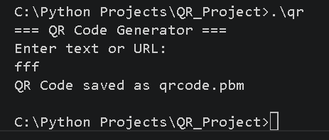

# QR Code Generator in C

A simple QR Code Generator written in C. This program generates a QR code from any text or website link and saves it as a **PBM image**.

---

## Features

- Generate QR codes from text.
- Generate QR codes from website links (URLs).
- Saves the QR code as `qrcode.pbm`.
- Simple and easy to use.

---

## Requirements

- GCC Compiler
- IrfanView (to open or convert the generated `.pbm` image)

---

## Project Files

- `main.c` – Main program.
- `qrcodegen.c` – QR code generation library.
- `qrcodegen.h` – Header file for the library.
- `qrcode.pbm` – Generated QR code (created after running the program).

---

## How to Compile

Open a terminal in the project folder and run:

```bash
gcc main.c qrcodegen.c -o qr
```

---

## How to Run

### Windows

```bash
.\qr
```

---

## How to Use

1. Run the program.
2. Enter any text or website link.
3. Press **Enter**.
4. The QR code will be saved as:

```text
qrcode.pbm
```

5. Open **qrcode.pbm** using **IrfanView**.
6. (Optional) Convert it to PNG, JPG, or another image format using IrfanView.

---

## Example

### Input

```text
=== QR Code Generator ===

Enter text or URL:
https://google.com
```

### Output

```text
QR Code saved as qrcode.pbm
```

---

## Sample Output

> Add screenshots here.

### Program



### Generated QR Code


---

## Technologies Used

- C Programming Language
- GCC Compiler
- qrcodegen Library

---

## Future Improvements

- Save QR codes directly as PNG.
- Allow users to choose the output file name.
- Add support for Wi-Fi QR codes.
- Improve the user interface.

---

## Author

**Afif**

GitHub: https://github.com/44afif44

---

## License

This project is open source and is available for learning and educational purposes.
